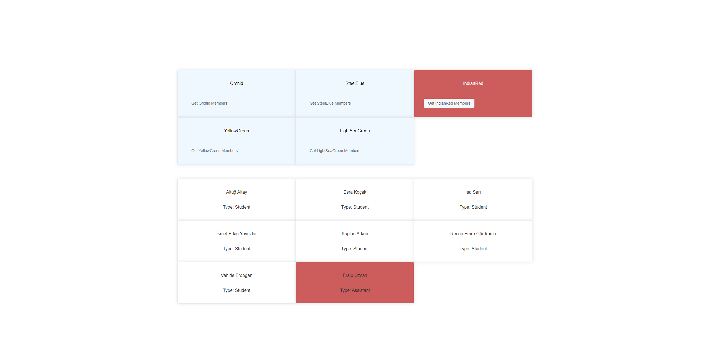

# Vue 3 + Vite

This template should help get you started developing with Vue 3 in Vite. The template uses Vue 3 `<script setup>` SFCs, check out the [script setup docs](https://v3.vuejs.org/api/sfc-script-setup.html#sfc-script-setup) to learn more.

## Recommended IDE Setup

- [VS Code](https://code.visualstudio.com/) + [Volar](https://marketplace.visualstudio.com/items?itemName=Vue.volar)

# All Groups :pushpin:

## Selected Orchid :pushpin:

## Selected SteelBlue :pushpin:

## Selected IndianRed :pushpin:

## Selected YellowGreen :pushpin:

## Selected LightSeaGreen :pushpin:

